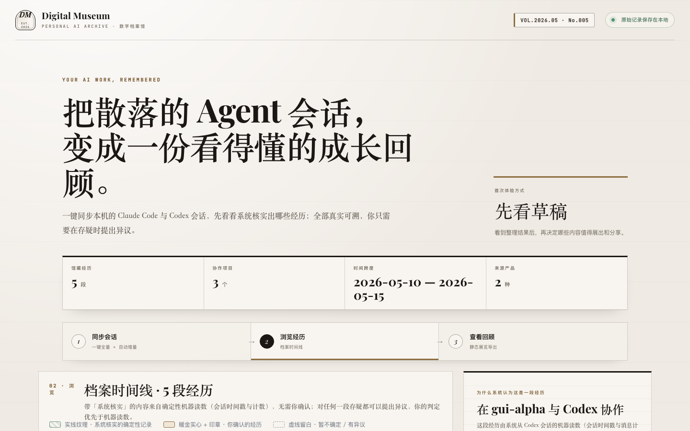
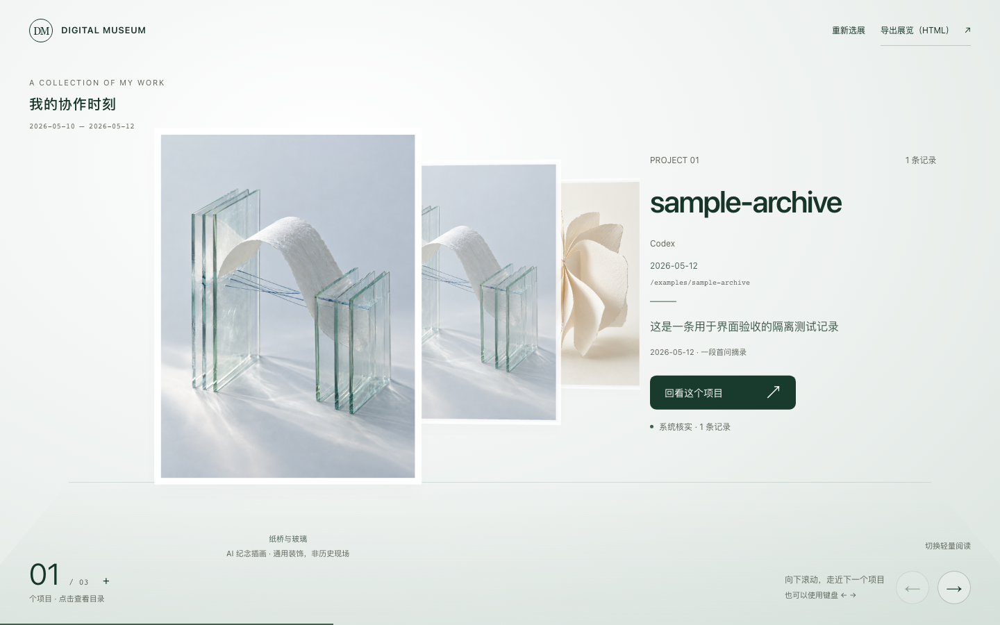

<div align="center">

# Digital Museum · AI 人生档案馆

**把散落的 Agent 会话，变成一份真实可溯、值得回看的成长展览。**

[](docs/prd/digital-museum-prd-v0.3.md)
[](#隐私与真实性边界)
[](#隐私与真实性边界)
[](LICENSE)


</div>

Digital Museum 是一个面向 AI 编码 Agent 用户的开源本地工具。它只读扫描本机的 Claude Code、Codex、pi 与 dsh 会话，把时间戳、项目归属、消息计数和首条真实用户消息整理成可追溯档案；你可以浏览时间线、对记录提出异议，再把选中的经历导出为一份离线可看的单文件 HTML 展览。

> 它不是另一个替你编故事的 AI 日记。当前版本没有模型调用：先忠实保存机器能够确定的读数，再把最终判断交还给你。

## 三步建馆

| 01 · 同步会话 | 02 · 浏览经历 | 03 · 查回顾 |
| --- | --- | --- |
| 打开应用自动增量同步，也可手动同步全部会话 | 按时间与项目浏览档案，展开逐字证据，对不准确记录提出异议 | 选择展项，滚动进入纵深画廊、展开正文与出处，并导出自包含 HTML |

<table>
  <tr>
    <td width="50%"></td>
    <td width="50%"></td>
  </tr>
  <tr>
    <td align="center">档案工作台 · 同步、浏览、异议</td>
    <td align="center">现代私人展馆 · 阅读与静态导出（截图为隔离验收样本）</td>
  </tr>
</table>

> 截图来自隔离的 E2E 样本数据，不包含真实用户会话。

## 它现在能做什么

- **四类 Agent 会话一键同步**：Claude Code、Codex、pi、dsh 共用确定性扫描骨架；只读源目录，不修改原会话文件。
- **唯一档案库与幂等增量**：重复同步会并入既有档案；中断或源内容变化时按完整性规则重建快照。
- **证据可回溯**：每段经历可以展开原文摘录、行号和内容指纹。会话时间戳、计数等确定性读数可标记为「系统核实」，但这不表示系统理解或核实了对话叙事。
- **用户判断优先**：任何记录都保留异议入口；用户已作出的存疑、修正或确认不会被后续同步覆盖。
- **现代私人展馆**：已选定 A 视觉接入真实项目。浅色空间、带画框的多层展品与无衬线成果说明；滚动或点击远处画框走近，当前画框可打开阅读。同一项目的多天记录共用一个入口，按最近活动排序；封面跟随项目身份固定。准备间可按月份筛选、展开按日勾选。走进项目后按日期切换正文与证据；手机、减少动态效果或 WebGL 不可用时使用轻量阅读。
- **成果在前，过程在后**：已有经历材料的项目会先展示“做了什么、推进到哪里”，点开后依次回看目标、关键过程、结果和原话出处；同时保留完整阶段故事与原始记录。没有这类材料时继续显示档案，不自动编造成果。
- **阅读已保存的故事**：项目详情可切换阶段故事与原始记录，逐章查看叙述和原话出处。仅显示本地已有的待确认草稿；自动生成、编辑和本人确认保存仍待实现。私人草稿放在被 Git 忽略的 `outputs/retrospectives/*/story.json`，不写入公开代码。故事范围独立于选展日期，现有静态 HTML 导出仍只含勾选的原始记录。
- **分组有依据**：按实际来源路径区分项目，跨 Agent 路径一致才并到同一入口。同名不同目录保持独立；旧 Claude 记录缺少真实 cwd、或来源有冲突时标为归属待确认。分组仅改变视图，保留每条记录、状态和出处。
- **纪念插画**：使用三张 AI 生成的通用馆藏插画，明确标为装饰，不代表事件现场，也不是根据个人会话自动绘制。当前正文仍来自确定性档案，尚未接入模型故事生成。
- **安全导出**：输出无脚本、自包含的单文件 HTML；导出前扫描常见密钥、本机路径和邮箱，命中后必须人工逐项确认。
- **档案备份 API**：支持 `archive-v3` ZIP 整库导出与“作为全新数据”恢复，内容哈希校验失败时拒绝写入。

## 快速本地启动

### 环境要求

- Node.js ≥ 22.13
- npm
- Python 3.11
- [uv](https://docs.astral.sh/uv/)

### 安装

```bash
git clone https://github.com/sunshine-lang/DigitalMuseum.git
cd DigitalMuseum
npm ci
npm run backend:sync
```

### 运行

打开两个终端。

```bash
# 终端 1：本地 API
npm run backend:dev

# 终端 2：Web 工作台
npm run dev:phase0
```

浏览器打开 <http://127.0.0.1:3001>。API 文档位于 <http://127.0.0.1:8010/docs>。

应用打开后会自动进行一次增量同步。档案为空时，也可以在首页点击「同步本机全部会话」。

## 支持范围

| 会话来源 | 本机只读目录 | 当前状态 |
| --- | --- | --- |
| Claude Code | `~/.claude/projects` | 已支持 |
| Codex | `~/.codex/sessions` | 已支持，仅统计用户主线程 |
| pi | `~/.pi/agent/sessions` | 已支持 |
| dsh | `~/.dsh/sessions` | 已支持，排除子代理与注入消息 |
| ChatGPT / WorkBuddy / OpenClaw | — | 尚未实现 |

当前明确不做：云部署、多用户、笔记上传、Git 仓库导入、照片导入，以及由模型自动概括并写成“事实”。这些边界见 [ADR-0001：档案库为根](docs/adr/0001-archive-root-stage-as-view.md) 与 [ADR-0002：单燃料极简](docs/adr/0002-single-fuel-agent-sessions.md)。

## 隐私与真实性边界

```text
本机会话目录（只读）
        ↓
确定性适配器：时间戳 / cwd / 消息计数 / 首条真实用户消息
        ↓
本地 SQLite 档案库 + 内容寻址证据文档
        ↓
时间线与异议 → 选展 → 敏感信息扫描 → 单文件 HTML
```

- 档案数据默认写入本机 `data/`，该目录已被 Git 忽略；当前没有云数据库和模型 API 调用。
- 证据文档不会整份复制会话，只保留确定性读数和首条真实用户消息摘录；源会话目录始终只读。
- 本地档案目前**没有静态加密**。请把本机账户、磁盘权限和导出的 HTML 当作隐私边界，不要导入或分享不应暴露的内容。
- 工作台会请求 Google Fonts，但不会随字体请求上传档案内容；断网时使用本机回退字体。静态展览导出本身无脚本、无外链。
- 纵深画廊的 Three.js 和插画均由本地前端提供；3D 库在进入画廊时加载。导出继续使用原有的午夜编年阅读版，不包含交互式 3D 场景与装饰插画。
- v0.3 的机器复核证据已记录，但真实数据大考仍有用户判定字段未填写，因此本项目不会宣称“已通过大考”。详见 [复考记录](docs/gate/real-data-exam-2026-08-25-v0.3.md)。

## 自动化验证

```bash
npm run test:backend   # Ruff + pytest：适配器、同步幂等、迁移与 API
npm run typecheck      # TypeScript
npm run lint           # ESLint
npm run test:local     # 本地构建、渲染冒烟、静态导出单测
npm run test:e2e       # Playwright 全链路
```

运行 E2E 前请停止 `npm run backend:dev`：隔离后端需要独占 `8010` 端口。macOS 使用 `npm run test:local`；`npm test` 需要 GNU `timeout`。

## 项目结构

```text
app/        Next.js App Router + vinext/Vite 前端
backend/    Python 3.11 + FastAPI + SQLAlchemy + Alembic 本地 API
data/       SQLite 档案库与内容寻址证据（运行时生成，Git 忽略）
docs/       PRD、ADR、真实数据 Gate、设计与阶段开发记录
scripts/    本地与 Linux 构建脚本
tests/      渲染、静态导出与 Playwright E2E
```

后端依赖方向保持为 `api → services → domain → core`。完整产品取舍请从 [PRD v0.3](docs/prd/digital-museum-prd-v0.3.md) 开始阅读。

## 当前阶段与下一步

当前交付是 **Phase 0 本地单用户原型**：同步 → 浏览 → 展览 → 静态导出的主链路已经实现。它仍不是生产级产品，也没有完成真实数据大考的用户判定。

下一阶段方向是从跨会话的重复指令中，用可回溯证据点亮“值得沉淀为 Skill 的流程机会”。在这个方向立项前，不会提前引入语义聚类或让模型把推断升级为事实。

## 参与项目

### 本次展示方向

画廊构图和滚动空间感参考 [Atmospheric Depth Gallery](https://tympanus.net/Tutorials/DepthGallery/)；实现围绕本项目的真实档案与证据阅读重新编写，未复制参考站的图片。新增依赖仅为 Three.js 与其 TypeScript 类型。插画及生成提示词见 `public/gallery/`。

欢迎提交 Issue，尤其是：

- 新 Agent 产品的真实会话格式样本与只读适配建议；
- 确定性扫描、隐私边界和导出安全问题；
- macOS 之外环境的可复现运行反馈；
- 你愿意保存或分享的展览叙事形式。

提交问题时请附最小复现步骤和脱敏日志，不要上传完整会话、API Key、邮箱、本机绝对路径或其他隐私数据。

## License

[MIT](LICENSE) © 2026 sunshine-lang

### 本地故事草稿

通过 `DIGITAL_MUSEUM_RETROSPECTIVES_DIR` 可指定草稿目录，默认是 `outputs/retrospectives`。API 只读取其下一层子目录中的 `story.json`，按 `project_key` 关联项目；格式和校验见 `StoryDraft`（`backend/app/domain/schemas.py`）。没有草稿时照常阅读原始记录。草稿独立于档案库，当前 ZIP 备份/恢复和清空档案库均不包含这些文件；需要留存时另行备份该目录。当前仓库不附带个人故事。

预存故事可附带可选 `exhibit` 字段作为成果优先阅读样本，结构见 `StoryExhibit`。通过 `/exhibition?exhibit=<story-id>` 可直接打开关联项目的展品；此入口依赖本机真实项目记录与草稿，仓库不会携带私人样本。

普通选展入口为 `/exhibition`，`/exhibition?view=gallery` 可直接进入默认多项目画廊。单件直达仍受真实项目和私有草稿约束，不会伪造额外展品。正式版本不含原型的 A/B/C 比较栏，也未把编年册/档案库两种未选方案接入。阅读页保留阶段故事、原始记录和全部出处；静态导出仍为既有无脚本阅读版。
